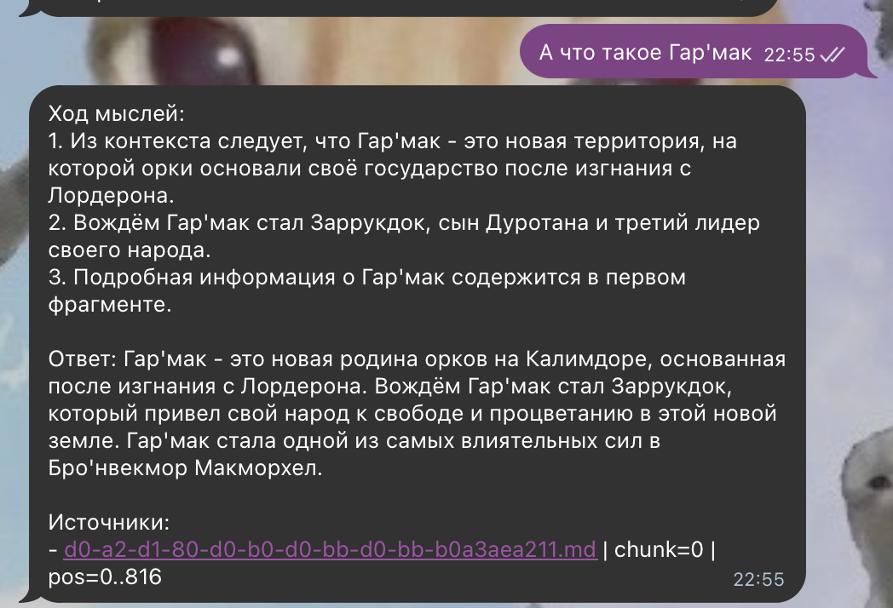
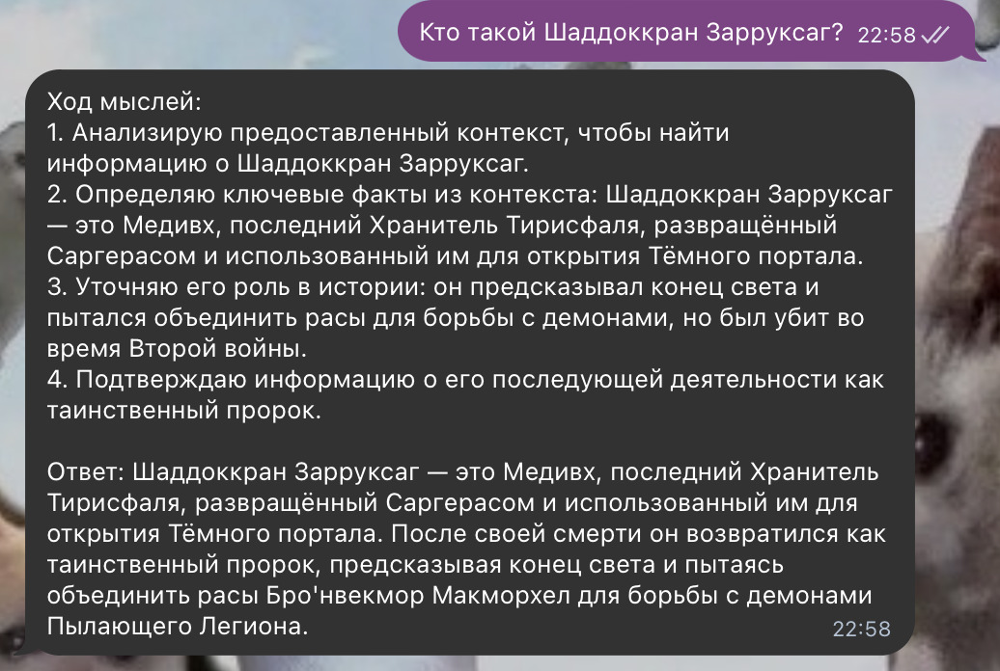
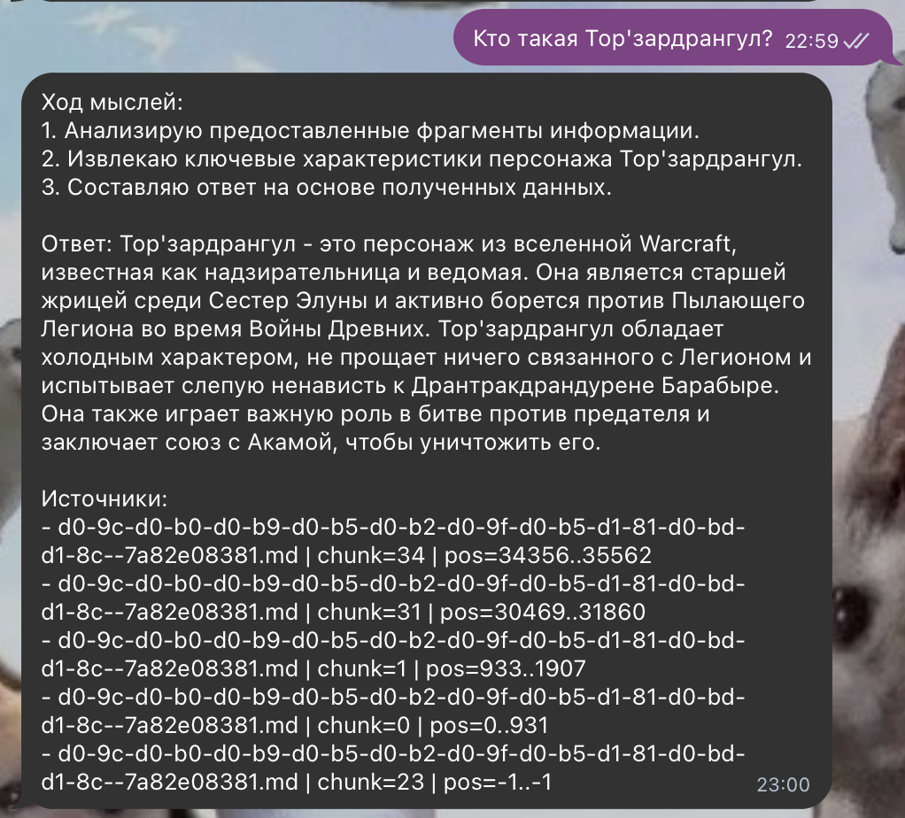

# Задание 1. Исследование моделей и инфраструктуры

## 1. Сравнение LLM

| Критерий                | Hugging Face (локально)                                                      | OpenAI (облако)                                               | YandexGPT (облако)                                                                                                                                     |
|-------------------------|------------------------------------------------------------------------------|---------------------------------------------------------------|--------------------------------------------------------------------------------------------------------------------------------------------------------|
| Качество ответов        | Llama 3.1 70B Instruct в LMArena (Text) имеет score 1294, votes 55,234       | GPT-5.1 score 1445, votes 5,187                               | Yandex позиционирует YandexGPT Pro для сложных запросов и задач с большим контекстом (подходит для RAG). У Pro контекст до 32k токенов                 |
| Скорость работы         | В среднем, 2-5 сек, но зависит от GPU. Для больших моделей нужна GPU-машина. | 100.3 tokens/s для GPT-5.1                                    | Есть shared режим (общий инстанс) и опция dedicated inference (выделенный инференс с гарантированными ресурсами) - это влияет на стабильность скорости |
| Стоимость использования | За токены $0, но есть стоимость GPU-серверов                                 | GPT-5.1: $1.750 / 1M input tokens, $14.000 / 1M output tokens | YandexGPT Pro 5.1 (sync): $0.003334/ 1000 input tokens и $0.003334 / 1000 output tokens. Async: $0.001667 / 1000 input и $0.001667 / 1000 output       |
| Стоимость владения      | Нужны GPU + DevOps. Пример: AWS g5.12xlarge (4×A10G) = $5.672/час            | Инфраструктуры нет (API)                                      | Инфраструктуры нет (API). Для стабильной прод-нагрузки можно использовать dedicated inference (это отдельная опция сервиса)                            |
| Простота развёртывания  | Сложно: инференс-сервер, GPU-драйверы, мониторинг, autoscaling               | Просто: API                                                   | Просто: API. Важный плюс: OpenAI-compatible API - полная совместимость с Responses API, Realtime API, Vector Store API, частичная с Completions API    |

### Вывод: 

- Если важны качество + быстро внедрить, то OpenAI (GPT-5.1).  
- Если нельзя отправлять данные наружу, то локальная HF-модель, но дороже по инфраструктуре.

---

## 2. Сравнение эмбеддингов

| Критерий                           | Sentence-Transformers (локально)                                                                                                                                                           | OpenAI Embeddings (облако)                                                                                                                                                                                   |
|------------------------------------|--------------------------------------------------------------------------------------------------------------------------------------------------------------------------------------------|--------------------------------------------------------------------------------------------------------------------------------------------------------------------------------------------------------------|
| Скорость создания индекса          | 170–750 queries/s на CPU и 4000–18000 queries/s на GPU (на примере `multi-qa-mpnet-base-dot-v1`/`multi-qa-mpnet-base-cos-v1` и `multi-qa-MiniLM-L6-dot-v1`/`multi-qa-MiniLM-L6-cos-v1`)    | Упирается в лимиты аккаунта (RPM/TPM) и сеть. В docs OpenAI показан пример лимитов в заголовках ответа: x-ratelimit-limit-requests: 60 и x-ratelimit-limit-tokens: 150000 (значения зависят от tier/модели). |
| Качество поиска                    | Высокое, есть возможность fine-tuning'а. Обрабатывает до 512 word pieces (примерно соответствует 512 subword-токенам)                                                                      | Высокое, особенно у text‑embedding‑3‑large.                                                                                                                                                                  |
| Стоимость владения и использования | Модели бесплатны (open-source), но плата за серверное железо. Пример стоимости GPU-сервера: AWS g5.xlarge = 1,067$/час (для EU Stockholm). Если держать 24/7: 1,067*24*365 = 9346,92$/год. | Оплата за токены (инфраструктура не нужна). 1M input tokens - 0,02$ (0,01$ за batch API) для `text-embedding-3-small` или 0,13$ (0,065$) для `text-embedding-3-large`.                                       |


### Вывод

- Если критично не отправлять документы во внешний облачный сервис или нужно дообучение под внутренний стиль документации, то выбираем Sentence-Transformers локально.
- Если приоритет - минимум инфраструктуры, простая эксплуатация и предсказуемая оплата по использованию, то выбираем OpenAI embeddings. Так же можно использовать в качестве MVP.
---

## 3. Сравнение векторных БД (ChromaDB vs FAISS)

| Критерий                                 | ChromaDB                                                                                                                    | FAISS                                                                                                                                                                        |
|------------------------------------------|-----------------------------------------------------------------------------------------------------------------------------|------------------------------------------------------------------------------------------------------------------------------------------------------------------------------|
| Скорость поиска и индексации             | Средняя задержка поиска в публичных бенчмарках: 2.58 ms на запрос. Оптимизирована под RAG.                                  | В публичных бенчмарках - 0.34 ms на запрос. Требует настройки.                                                                                                               |
| Сложность внедрения и поддержки          | Простая установка, встроенная обработка - коллекции/документы/метаданные и фильтрация из коробки.                           | Библиотека для similarity search (C++ + Python wrappers), а не БД: инфраструктуру хранения/бэкапов и метаданные нужно организовывать в приложении.                           |
| Удобство в работе                        | Адаптировано для RAG-прототипов: коллекции + метаданные из коробки                                                          | Просто встраивать в сервис для максимальной скорости; поддерживает сценарии от малого до очень большого объёма данных. Для настройки работы в prod нужна хорошая экспертиза. |
| Стоимость владения (учёт инфраструктуры) | Open-source, бесплатно.<br>Инфраструктурно обычно достаточно CPU/RAM + SSD и процессов бэкапа каталога `persist_directory`. | Open-source.<br>Для скорости лучше использовать GPU + БД для метаданных.                                                                                                     |

Вывод по векторной БД:  
- FAISS - для локальной разработки. Так же если нужен движок максимальной скорости внутри сервиса, а метаданные/надёжность будут обеспечены отдельными компонентами (например, Postgres + бэкапы).  
- ChromaDB - хороший выбор, если нужно векторное хранилище (метаданные/фильтры/персистентность) и один узел.

---

## 4. Рекомендуемая конфигурация сервера


- CPU: 16 vCPU  
- RAM: 64 GB  
- GPU: 1× NVIDIA L4/A10 (24 GB) - в основном для эмбеддингов/индексации  
- SSD: NVMe 1–2 TB  

---

## Итоговые рекомендации

### Вариант A - Самый быстрый MVP
- LLM: OpenAI (GPT-5.1)
- Embeddings: OpenAI
- Vector DB: ChromaDB
- Плюс: быстро, минимум DevOps  
- Минус: больше данных уходит в облако

### Вариант B - Гибрид
- LLM: OpenAI (GPT-5.1) или YandexGPT
- Embeddings: Sentence-Transformers локально
- Vector DB: FAISS + Postgres метаданные (или ChromaDB для простоты)
- Плюс: документы и индекс внутри периметра, в LLM уходит только top-chunks  
- Минус: нужен GPU для индексации и чуть сложнее архитектура

### Вариант C - Полностью локально
- LLM: HF локально (например 70B)
- Embeddings: локально
- Vector DB: FAISS
- Плюс: полностью локально, защищено
- Минус: высокая стоимость владения и DevOps

### Выбор лучшего варианта
Рекомендую Вариант B гибрид.  
Он лучше всего подходит под корпоративную базу знаний, потому что:
- индекс и документы остаются внутри (важно для SOC 2 и внутренних политик),
- облачная LLM даёт качество и не требует GPU-фермы,
- GPU используется в основном на ingestion/обновления (а не на каждую сессию).

# Задание 2. Подготовка базы знаний

- [Директория с базой переименованных терминов](knowledge_base/renamed)
- Для обработки была выбрана существующая вселенная [World Of Warcraft](https://wowwiki.fandom.com/ru/wiki/%D0%9F%D0%BE%D1%80%D1%82%D0%B0%D0%BB:%D0%93%D0%BB%D0%B0%D0%B2%D0%BD%D0%B0%D1%8F). Заменялись ключевые персонажи, континенты и некоторые расы.
- Запуск скриптов сбора и обработки данных происходит через единый файл [main.py](apps/terms_builder/main.py).
    ```bash
    python3 -m venv ./.venv
    source ./.venv/bin/activate
    pip install -r ./data/requirements.txt
    python3 main.py
    ```
  Статьи, из которых происходит сбор информации перечисляются в файле [wiki_urls.txt](apps/terms_builder/wiki_urls.txt)
  Если есть необходимость пересобрать заново статьи, то в main.py в вызове функции run необходимо передать занчение параметра recollect=True. Таким образом скрипт пройдётся заново по ссылкам на статьи, соберёт инфу, соберёт термины для переименования и переименует их. Однако, чтобы переименование терминов прошло качественней, необходимо будет добавить в terms_map.json дополнительные найденные склонения терминов.
  - В файле [terms_map.json](knowledge_base/terms_map.json) находится маппинг терминов.
      ```json
      {
          "source": "Альянс", // Исходное значение, которое будет заменяться
          "target": "Шаддрантордран Тра'кмак", // Значение, на которое производится замена
          "aliases": // Массив склонений для более точного поиска и замены
          [
              "Альянс",
              "альянса",
              "альянсу"
          ],
          "replace_lowercase": true
      }
      ```

# Задание 3. Создание векторного индекса базы знаний

## 1. Модель эмбеддингов
- Название: `intfloat/multilingual-e5-base`
- Источник: Hugging Face (Sentence-Transformers / Transformers)
- Размер эмбеддингов: 768
- Особенности: используется нормализация эмбеддингов и FAISS `IndexFlatIP` (cosine similarity ≈ inner product при нормализации).  
  Для E5 применяется префикс `passage:` для документов и `query:` для запросов.

## 2. База знаний
- Директория KB: `knowledge_base/renamed`
- Формат документов: `.md` (предварительно очищаются от Markdown-разметки и переводятся в “plain text”)

## 3. Чанкинг
- Сплиттер: `RecursiveCharacterTextSplitter` (LangChain)
- Параметры: `chunk_size=1400` символов, `chunk_overlap=200` символов
- Метаданные чанков: `source_path`, `title`, `chunk_in_doc`, `start_char`, `end_char`, `chunk_id`

## 4. Индекс
- Векторная БД: FAISS
- Тип индекса: `faiss.IndexFlatIP`
- Файлы результата:
  - `knowledge_base/index/faiss.index` - индекс
  - `knowledge_base/index/chunks.jsonl` - тексты чанков + метаданные
  - `knowledge_base/index/index_meta.json` - мета-информация о сборке

## 5. Как собрать индекс

```bash
python3 apps/index_builder/build_index.py \
  --kb_dir knowledge_base/renamed \
  --out_dir knowledge_base/index \
  --model intfloat/multilingual-e5-base \
  --chunk_size 1400 \
  --chunk_overlap 200 \
  --batch 64
```

## 6. Статистика сборки (по факту запуска)
- Документов: 32
- Чанков в индексе: 703
- Время генерации (embedding + build): 37.826s
- Batch size: 64

Выходные файлы:

- `knowledge_base/index/faiss.index` - индекс
- `knowledge_base/index/chunks.jsonl` - чанки + метаданные (по строке на чанк)
- `knowledge_base/index/index_meta.json` - сводные метрики (модель, кол-во файлов/чанков, время сборки и т.д.)

## 7. Пример запроса к индексу

```bash
python3 apps/index_builder/query_index.py \
  --index_dir knowledge_base/index \
  --model intfloat/multilingual-e5-base \
  --q "Что такое Бро'нвекмор Макморхел?" \
  --k 5
  
python3 apps/index_builder/query_index.py \
  --index_dir knowledge_base/index \
  --model intfloat/multilingual-e5-base \
  --q "Кто такая Норкирзок Зулзирдранкхар?" \
  --k 5
  
python3 apps/index_builder/query_index.py \
  --index_dir knowledge_base/index \
  --model intfloat/multilingual-e5-base \
  --q "Кто такая Кранзиркран Сагкир?" \
  --k 5
```

Скрипт выведет `k` наиболее релевантных чанков с:

- score
- `source_path`, `title`, `chunk_in_doc`
- текст чанка

# Задание 4. Реализация RAG-бота с техниками промптинга

Реализован [Telegram-бот (запущен локально)](https://t.me/architecture_rag_bot), ищущий данные по базе знаний с применением Few-shot и CoT. Эмбеддинг - `intfloat/multilingual-e5-base`, LLM локально использовалась `qwen2.5:7b-instruct`

## Индекс

Используется индекс из knowledge_base/index:
- `knowledge_base/index/faiss.index`
- `knowledge_base/index/chunks.jsonl`
- `knowledge_base/index/index_meta.json`

## Запуск

```bash
python3 -m venv venv
source venv/bin/activate
pip install -r requirements.txt 
```

### Запуск REPL-интерфейса (для отладки)

```bash
python3 apps/rag_bot/src/repl.py \
  --index_dir ../knowledge_base/index \
  --embed_model intfloat/multilingual-e5-base \
  --k 5
```

### Запуск работы через Telegram-бота

```bash
python3 apps/rag_bot/src/telegram_bot.py \
  --index_dir ../knowledge_base/index \
  --embed_model intfloat/multilingual-e5-base \
  --k 5
```

## Примеры работы

### Успешные ответы

1. 
2. 
3. 
4. 
5. 

### Неуспешные ответы

1. 
2. 


