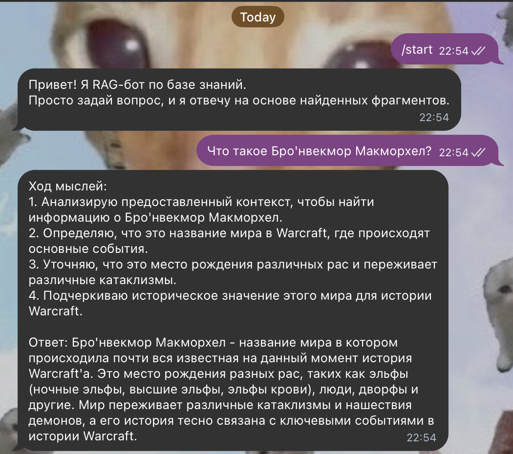
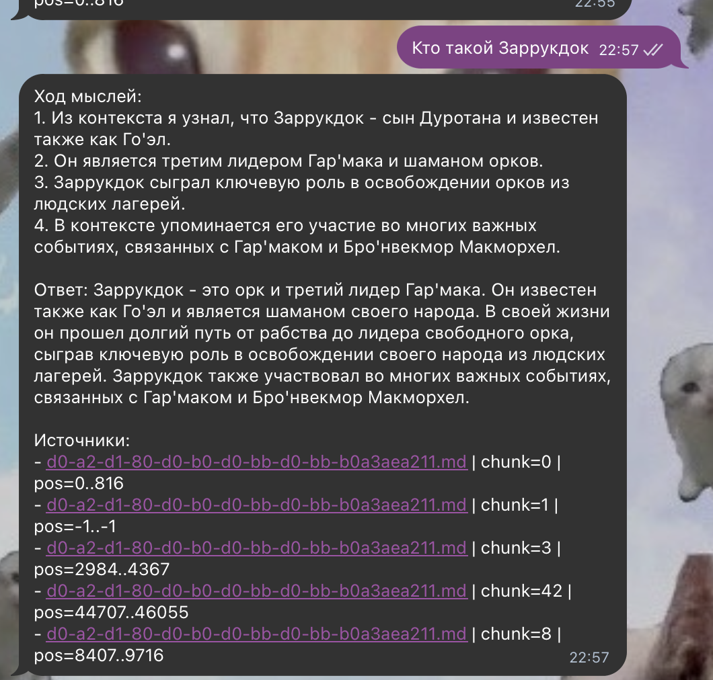
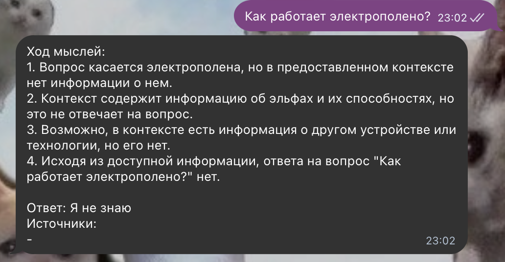

# Реализация RAG-бота с техниками промптинга

Реализован [Telegram-бот (запущен локально)](https://t.me/architecture_rag_bot), ищущий данные по базе знаний с применением Few-shot и CoT. Эмбеддинг - `intfloat/multilingual-e5-base`, LLM локально использовалась `qwen2.5:7b-instruct`

## Индекс

Используется индекс из Task03:
- `Task03/index/faiss.index`
- `Task03/index/chunks.jsonl`
- `Task03/index/index_meta.json`

## Запуск

```bash
cd Task04
python3 -m venv venv
source venv/bin/activate
pip install -r requirements.txt 
```

### Запуск REPL-интерфейса (для отладки)

```bash
python3 src/repl.py \
  --index_dir ../Task03/index \
  --embed_model intfloat/multilingual-e5-base \
  --k 5
```

### Запуск работы через Telegram-бота

```bash
python3 src/telegram_bot.py \
  --index_dir ../Task03/index \
  --embed_model intfloat/multilingual-e5-base \
  --k 5
```

## Примеры работы

### Успешные ответы

1. 
2. 
3. 
4. 
5. 

### Неуспешные ответы

1. 
2. 

